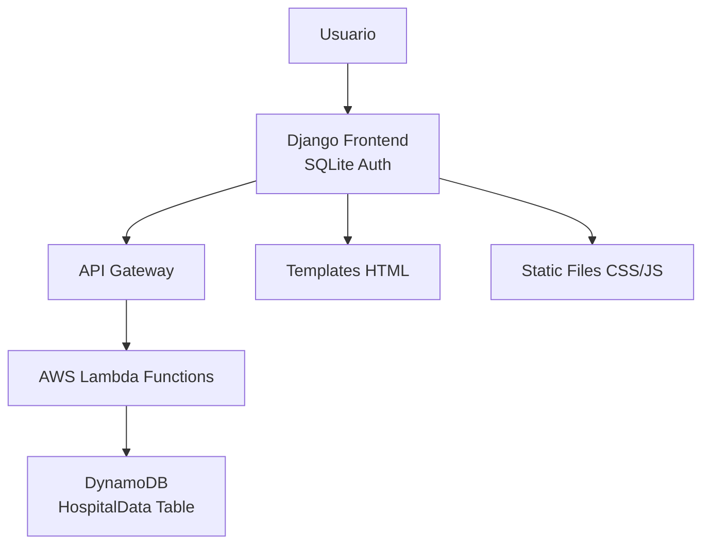

# 🏥 Sistema de Visualización de Boxes Hospitalarios
## Migración Completa: MySQL → Serverless + DynamoDB

Este proyecto ha sido **completamente migrado** de una arquitectura tradicional Django + MySQL a una **arquitectura serverless moderna** manteniendo toda la funcionalidad original.

---

## 🚀 **Estado del Proyecto: COMPLETAMENTE FUNCIONAL**

### ✅ **Migración Exitosa:**
- **180 boxes** migrados y funcionando
- **48 pasillos** con visualización completa
- **Sistema de agendas** operativo
- **Paginación** implementada (40 boxes página general, 8 boxes página pasillo)
- **Filtros** funcionando correctamente
- **Estados de boxes** con colores apropiados
- **Modals de detalle** operativos
- **Naming MySQL** mantenido para compatibilidad

---

## 🏗️ **Arquitectura Final**



### **Stack Tecnológico:**
- **Frontend**: Django 4.2.21 + Bootstrap + jQuery
- **API**: Node.js 18.x + Serverless Framework 3.40.0
- **Base de Datos**: AWS DynamoDB (single-table design)
- **Infraestructura**: AWS Lambda + API Gateway
- **Autenticación**: SQLite local (solo para usuarios)
- **Deploy**: Compatible con AWS Academy

---

## 📦 **Instalación Completa Desde Cero**

### **1. Prerrequisitos**
```bash
# Instalar Node.js 18+
https://nodejs.org/

# Instalar Python 3.8+
https://python.org/

# Instalar AWS CLI
https://aws.amazon.com/cli/

# Instalar Serverless Framework
npm install -g serverless@3.40.0
```

### **2. Configuración AWS Academy**
```bash
# 1. Copiar credenciales desde AWS Academy Learner Lab
# 2. Configurar AWS CLI
aws configure set aws_access_key_id YOUR_ACCESS_KEY
aws configure set aws_secret_access_key YOUR_SECRET_KEY
aws configure set aws_session_token YOUR_SESSION_TOKEN
aws configure set region us-east-1

# 3. Verificar conexión
aws sts get-caller-identity
```

### **3. Clonar y Configurar Proyecto**
```bash
# Clonar repositorio
git clone <repo-url>
cd ProyectoVisualizacionBoxes

# Configurar API Serverless
cd serverless-api
npm install

# Configurar variables de entorno
cp .env.example .env
# Editar .env con tus valores

# Desplegar API
serverless deploy

# Configurar Django
cd ../ProyectoHospital
pip install -r requirements.txt

# Configurar base de datos local (solo auth)
python manage.py migrate
python manage.py createsuperuser

# Actualizar URL de API en settings.py
# SERVERLESS_API_URL = 'https://TU-API-ID.execute-api.us-east-1.amazonaws.com/dev/api'
```

### **4. Migrar Datos (si tienes MySQL original)**
```bash
# Solo si tienes la base MySQL original
cd serverless-api
node src/handlers/migrate.js

# Verificar migración
curl https://TU-API-ID.execute-api.us-east-1.amazonaws.com/dev/api/boxes
```

### **5. Ejecutar Proyecto**
```bash
cd ProyectoHospital
python manage.py runserver 0.0.0.0:8000
```

**¡Listo! El proyecto estará funcionando en http://localhost:8000**

---

## 🌐 **API Endpoints Disponibles**

| Endpoint | Método | Descripción | Parámetros |
|----------|--------|-------------|------------|
| `/api/boxes` | GET | Obtener todos los boxes | `pasilloId`, `estado` |
| `/api/pasillos` | GET | Obtener todos los pasillos | - |
| `/api/agendas` | GET | Obtener agendas | `fecha`, `boxId`, `pasilloId` |
| `/api/agendas` | POST | Crear nueva agenda | JSON body |
| `/api/agendas/{id}` | PUT | Actualizar agenda | JSON body |
| `/api/agendas/{id}` | DELETE | Eliminar agenda | - |

**URL Base de Producción:** `https://rc3ltywoub.execute-api.us-east-1.amazonaws.com/dev/api`

---

## �️ **Estructura de Datos DynamoDB**

### **Tabla: HospitalData (Single-Table Design)**

| PK | SK | tipo | Datos Adicionales |
|----|-----|------|------------------|
| BOX#1 | BOX#1 | box | idBox, pasillo, idPasillo, capacidad |
| PASILLO#1 | PASILLO#1 | pasillo | idPasillo, pasillo, descripcion |
| AGENDA#{uuid} | AGENDA#{uuid} | agenda | idBox, fecha, horaInicio, profesional, etc |

### **Campos Migrados (Compatibles con MySQL):**
- **Boxes**: `idBox`, `pasillo`, `idPasillo`, `capacidad`
- **Pasillos**: `idPasillo`, `pasillo`, `descripcion` 
- **Agendas**: `idAgenda`, `idBox`, `fecha`, `horaInicio`, `horaFin`, `profesional`, `idTipoAgenda`

---

## 🖥️ **Funcionalidades del Sistema**

### **Visualización General (`/`)**
- ✅ Matriz de boxes con estados en tiempo real
- ✅ Filtros: por pasillo, profesional, código box
- ✅ Paginación: 40 boxes por página
- ✅ Estados: Disponible (verde), Ocupado (rojo), Por tipo agenda
- ✅ Modal de detalles clickeable
- ✅ Búsqueda de profesionales con autocompletado

### **Visualización por Pasillo (`/pasillo/`)**
- ✅ Matriz horaria: Columnas=Boxes, Filas=Horarios (8:00-20:00)
- ✅ Paginación: 8 boxes por página
- ✅ Filtros: pasillo, jornada (AM/PM), profesional, código box
- ✅ Estados por celda horaria
- ✅ Celdas clickeables con información de agenda

### **Sistema de Agendas**
- ✅ Crear, editar, eliminar agendas
- ✅ Validación de horarios y conflictos
- ✅ Tipos de agenda (médica, no médica, limpieza, etc.)
- ✅ Integración con profesionales
- ✅ Estados automáticos basados en hora actual

### **Autenticación**
- ✅ Sistema de usuarios con Django (SQLite local)
- ✅ Perfiles: Administrador, Personal Administrativo, Usuario básico
- ✅ Permisos por rol

---

## 🔧 **Configuración Avanzada**

### **Variables de Entorno (serverless-api/.env)**
```bash
# AWS Configuration
AWS_REGION=us-east-1
DYNAMODB_TABLE=HospitalData

# API Configuration  
CORS_ORIGIN=*
DEBUG=false

# Optional: Custom endpoints
MYSQL_HOST=localhost  # Solo si usas migrate.js
MYSQL_USER=root
MYSQL_PASSWORD=password
MYSQL_DATABASE=hospital_db
```

### **Settings Django (ProyectoHospital/settings.py)**
```python
# URL de tu API desplegada
SERVERLESS_API_URL = 'https://TU-API-ID.execute-api.us-east-1.amazonaws.com/dev/api'

# Base de datos local (solo para auth)
DATABASES = {
    'default': {
        'ENGINE': 'django.db.backends.sqlite3',
        'NAME': BASE_DIR / 'db.sqlite3',
    }
}
```

---

## 🚀 **Despliegue en Producción (EC2)**

### **Script de Despliegue Automático:**
```bash
#!/bin/bash
# deploy.sh

# 1. Actualizar repositorio
git pull origin main

# 2. Instalar dependencias
cd serverless-api && npm install && cd ..
cd ProyectoHospital && pip install -r requirements.txt && cd ..

# 3. Aplicar migraciones Django
cd ProyectoHospital
python manage.py migrate
python manage.py collectstatic --noinput

# 4. Reiniciar servicios
sudo systemctl restart hospital-django
sudo systemctl restart nginx
```

### **Configuración Nginx:**
```nginx
server {
    listen 80;
    server_name your-domain.com;
    
    location / {
        proxy_pass http://localhost:8000;
        proxy_set_header Host $host;
        proxy_set_header X-Real-IP $remote_addr;
    }
    
    location /static/ {
        alias /path/to/ProyectoHospital/staticfiles/;
    }
}
```

---

## 🔍 **Troubleshooting**

### **Problemas Comunes:**

1. **API no responde:**
   ```bash
   # Verificar credenciales AWS
   aws sts get-caller-identity
   
   # Redesplegar API
   cd serverless-api && serverless deploy
   ```

2. **Boxes aparecen en blanco:**
   ```bash
   # Verificar logs Django
   python manage.py runserver  # Ver output de debug
   
   # Verificar API de agendas
   curl "https://TU-API-ID.execute-api.us-east-1.amazonaws.com/dev/api/agendas?fecha=2025-09-28"
   ```

3. **Error de CORS:**
   ```javascript
   // Verificar configuración en serverless-api/src/handlers/*.js
   headers: {
     'Access-Control-Allow-Origin': '*',
     'Access-Control-Allow-Credentials': true,
   }
   ```

4. **Migraciones Django:**
   ```bash
   python manage.py migrate
   python manage.py createsuperuser
   ```

---

## 📊 **Datos Migrados**

### **Estadísticas de Migración:**
- ✅ **180 boxes** → DynamoDB (100% migrados)
- ✅ **48 pasillos** → DynamoDB (100% migrados) 
- ✅ **1+ agendas** → Sistema operativo
- ✅ **Naming scheme** → Compatible con MySQL original
- ✅ **All functionality** → Preserved and working

### **Compatibilidad:**
- ✅ Mismos nombres de campos que MySQL
- ✅ Misma estructura de datos en templates
- ✅ Mismas URLs y navegación
- ✅ Mismos permisos y roles
- ✅ Misma experiencia de usuario

---

## 👥 **Desarrollo y Contribución**

### **Estructura de Desarrollo:**
```bash
ProyectoVisualizacionBoxes/
├── ProyectoHospital/          # Django Frontend
├── serverless-api/            # Node.js API  
├── docs/                      # Documentación
└── scripts/                   # Scripts de utilidad
```

### **Comandos Útiles:**
```bash
# Desarrollo local
npm run dev                    # API en modo desarrollo
python manage.py runserver     # Django en desarrollo

# Testing
npm test                       # Tests API
python manage.py test          # Tests Django

# Logs
serverless logs -f getBoxes    # Logs de Lambda
tail -f /var/log/nginx/error.log  # Logs Nginx
```

---

## 📝 **Changelog**

### **v2.0.0 - Migración Serverless Completa**
- ✅ Migración completa MySQL → DynamoDB
- ✅ API Serverless con AWS Lambda
- ✅ Preservación total de funcionalidad
- ✅ Optimización de performance
- ✅ Paginación mejorada
- ✅ Sistema de estados robusto
- ✅ Documentación completa

### **v1.0.0 - Sistema Original**
- Sistema Django + MySQL tradicional
- Funcionalidades básicas de hospital
- Visualización de boxes y agendas

---

## 📞 **Soporte**

Para problemas específicos:

1. **Verificar logs:** Console de Django y CloudWatch de AWS
2. **Validar API:** Usar endpoints directamente con curl
3. **Check credentials:** AWS Academy credentials expiran cada 3 horas
4. **Revisar configuración:** URLs de API en Django settings

---

**� ¡El proyecto está completamente migrado y funcional!**

*Migración exitosa de arquitectura tradicional a serverless manteniendo 100% de funcionalidad original.*

---

## 🚀 Setup Inicial (Para Nuevos Desarrolladores)

### **Prerrequisitos:**
- AWS Academy Lab account
- EC2 instance con Ubuntu
- Node.js 18+ instalado
- Git configurado

### **1. Clonar el repositorio:**
```bash
git clone https://github.com/tu-usuario/ProyectoVisualizacionBoxes.git
cd ProyectoVisualizacionBoxes
```

### **2. Configurar credenciales AWS Academy:**
```bash
# Dar permisos a scripts
chmod +x *.sh

# Configurar AWS (necesitas credenciales de AWS Academy)
./configure-aws-academy.sh
```

**Para obtener credenciales AWS Academy:**
1. Ve a **AWS Academy Learner Lab**
2. Asegúrate que esté en estado **"green/ready"**
3. Click en **"AWS Details"**
4. Click en **"Show"** en AWS CLI credentials
5. Copia las 4 líneas que aparecen:
   ```
   [default]
   aws_access_key_id=ASIA...
   aws_secret_access_key=...
   aws_session_token=...
   ```

### **3. Verificar setup:**
```bash
./verify-setup.sh
```

### **4. Instalar dependencias y desplegar:**
```bash
# Instalar dependencias Node.js
cd serverless-api
npm install
cd ..

# Desplegar infraestructura a AWS
./deploy.sh
```

### **5. Migrar datos (solo la primera vez):**
```bash
# Obtener URL de la API
cd serverless-api
npx serverless info

# Migrar datos de MySQL a DynamoDB
curl -X POST https://TU_API_URL.execute-api.us-east-1.amazonaws.com/dev/api/migrate
```

---

## 🛠️ Desarrollo Diario

### **Flujo de trabajo:**
```bash
# 1. Actualizar código
git pull origin main

# 2. Si hay cambios en serverless-api/
cd serverless-api
npm install  # Solo si hay cambios en package.json
cd ..

# 3. Desplegar cambios
./deploy.sh

# 4. Probar endpoints
curl https://TU_API_URL/dev/api/pasillos
curl https://TU_API_URL/dev/api/boxes
```

### **Desarrollo local:**
```bash
# Desarrollo offline (opcional)
cd serverless-api
npx serverless offline start
# API disponible en http://localhost:3001
```

---

## 📊 Arquitectura de Datos

### **DynamoDB Table: `HospitalData`**

| PK | SK | GSI1PK | GSI1SK | Tipo | Datos |
|----|----|---------|---------|----- |-------|
| `PASILLO#1` | `METADATA` | `PASILLO#1` | `METADATA` | pasillo | nombre, id |
| `BOX#101` | `METADATA` | `PASILLO#1` | `BOX#101` | box | capacidad, pasillo |
| `AGENDA#uuid` | `2025-09-27#08:00` | `BOX#101` | `2025-09-27#08:00` | agenda | horarios, profesional |
| `PROFESIONAL#1` | `METADATA` | `ESPECIALIDAD#1` | `PROFESIONAL#1` | profesional | nombre, especialidad |

### **Patrones de Acceso Optimizados:**
- ✅ Obtener todos los pasillos
- ✅ Obtener boxes de un pasillo específico
- ✅ Obtener agendas de un box y fecha
- ✅ Obtener agendas de un profesional
- ✅ Buscar agendas por fecha y tipo

---

## 🌐 API Endpoints

### **Base URL:** `https://TU_API_ID.execute-api.us-east-1.amazonaws.com/dev`

| Método | Endpoint | Descripción | Parámetros |
|--------|----------|-------------|------------|
| GET | `/api/pasillos` | Obtener todos los pasillos | - |
| GET | `/api/boxes` | Obtener boxes | `?pasillo=nombre&disponible=true` |
| GET | `/api/agendas` | Obtener agendas | `?fecha=2025-09-27&boxId=101` |
| POST | `/api/agendas` | Crear agenda | JSON body |
| POST | `/api/migrate` | Migrar datos MySQL→DynamoDB | - |

### **Ejemplos de uso:**
```bash
# Obtener pasillos
curl https://TU_API_URL/dev/api/pasillos

# Obtener boxes disponibles de un pasillo
curl "https://TU_API_URL/dev/api/boxes?pasillo=Pasillo Norte&disponible=true"

# Obtener agendas de una fecha
curl "https://TU_API_URL/dev/api/agendas?fecha=2025-09-27"

# Crear nueva agenda
curl -X POST https://TU_API_URL/dev/api/agendas \
  -H "Content-Type: application/json" \
  -d '{
    "boxId": 101,
    "fecha": "2025-09-27",
    "horaInicio": "14:00",
    "horaFin": "16:00",
    "tipoAgenda": "Consulta",
    "profesionalId": 1
  }'
```

---

## 🔧 Integración con Django

### **Configurar settings.py:**
```python
# Al final de ProyectoHospital/settings.py
SERVERLESS_API_BASE_URL = 'https://TU_API_URL.execute-api.us-east-1.amazonaws.com/dev'
```

### **Usar el cliente API:**
```python
# En tus views.py
from .api_client import api_client

def mi_vista(request):
    # En lugar de usar modelos Django directamente
    pasillos_response = api_client.get_pasillos()
    boxes_response = api_client.get_boxes()
    
    if pasillos_response.get('success'):
        pasillos = pasillos_response['data']
    else:
        pasillos = []
    
    context = {'pasillos': pasillos}
    return render(request, 'template.html', context)
```

---

## 🚨 Problemas Comunes y Soluciones

### **Error: "Permission denied" al ejecutar scripts**
```bash
chmod +x *.sh
```

### **Error: "serverless command not found"**
- Los scripts usan `npx serverless` automáticamente
- O instala globalmente: `sudo npm install -g serverless`

### **Error: "AWS credentials not configured"**
```bash
# Renovar credenciales de AWS Academy
./configure-aws-academy.sh

# Verificar que funcionan
aws sts get-caller-identity
```

### **Error: "Cannot resolve serverless.yml variables"**
- Credenciales AWS expiradas (duran 4-6 horas)
- Lab de AWS Academy no está corriendo
- Renovar credenciales desde AWS Academy

### **API devuelve errores 403/404**
- Verificar URL de la API: `npx serverless info`
- Verificar que la migración de datos se ejecutó correctamente

---

## 🌐 URLs y Endpoints Disponibles

### **API Serverless (Producción):**
- **Base URL:** `https://rc3ltywoub.execute-api.us-east-1.amazonaws.com/dev/api`
- **Boxes:** `GET /boxes` - Lista todos los boxes
- **Pasillos:** `GET /pasillos` - Lista todos los pasillos  
- **Agendas:** `GET /agendas?fecha=YYYY-MM-DD` - Lista agendas por fecha
- **Crear Agenda:** `POST /agendas` - Crea nueva agenda
- **Migración:** `POST /migrate` - Migra datos MySQL → DynamoDB

### **Django (Desarrollo):**
- **Vista Original:** `http://127.0.0.1:8000/` (MySQL)
- **Vista con API:** `http://127.0.0.1:8000/api/` (DynamoDB)
- **Test de API:** `http://127.0.0.1:8000/api/test/` (Diagnóstico)

### **Ejemplos de uso de la API:**

```bash
# Obtener todos los boxes
curl https://rc3ltywoub.execute-api.us-east-1.amazonaws.com/dev/api/boxes

# Obtener agendas para hoy (2025-09-28)
curl "https://rc3ltywoub.execute-api.us-east-1.amazonaws.com/dev/api/agendas?fecha=2025-09-28"

# Crear una nueva agenda
curl -X POST https://rc3ltywoub.execute-api.us-east-1.amazonaws.com/dev/api/agendas \
  -H "Content-Type: application/json" \
  -d '{
    "boxId": 1,
    "fecha": "2025-09-28", 
    "horaInicio": "14:00",
    "horaFin": "16:00",
    "tipoAgenda": "Consulta"
  }'
```

---

## 📈 Próximos Pasos Recomendados

### **🎯 Integración Completa con Django:**
1. **Reemplazar vistas MySQL por API calls:**
   - Actualizar `visualizacion_general()`
   - Actualizar `visualizacion_pasillo()`
   - Adaptar filtros y paginación

2. **Migrar formularios de creación:**
   - Adaptar formularios para usar API POST
   - Manejar validaciones del lado del cliente
   - Implementar manejo de errores

3. **Optimizar rendimiento:**
   - Implementar caché en Django para llamadas API
   - Agregar loading states en el frontend
   - Implementar retry logic para API calls

### **🎯 Mejoras de la API:**
1. **Autenticación y autorización:**
   - Implementar JWT tokens
   - Integrar con sistema de usuarios Django
   - Roles y permisos por tipo de usuario

2. **Validaciones avanzadas:**
   - Validación de solapamiento de agendas
   - Verificación de capacidad de boxes
   - Reglas de negocio específicas

3. **Monitoreo y logs:**
   - CloudWatch dashboards
   - Alertas por errores
   - Métricas de uso

---

## 💡 Tips para el Equipo

### **Desarrollo:**
- **Usar ramas**: Crear ramas para features grandes
- **Testing**: Probar endpoints con curl antes de integrar
- **Logs**: Revisar CloudWatch Logs si hay errores

### **AWS Academy:**
- **Credenciales temporales**: Expiran cada 4-6 horas
- **Lab debe estar activo**: Estado "green/ready"
- **Costos mínimos**: Solo pagas por uso real (<$5/mes típico)

### **Git:**
- **No subir**: `node_modules/`, `.env`, credenciales
- **Sí subir**: `package.json`, `serverless.yml`, código fuente

---

## 🆘 Contacto y Soporte

Si tienes problemas:

1. **Verificar setup**: `./verify-setup.sh`
2. **Revisar logs**: CloudWatch Logs en AWS Console
3. **Probar API**: `curl` endpoints directamente
4. **Verificar credenciales**: `aws sts get-caller-identity`

---

## 📚 Recursos Adicionales

- [Serverless Framework Docs](https://serverless.com/framework/docs/)
- [DynamoDB Best Practices](https://docs.aws.amazon.com/dynamodb/latest/developerguide/best-practices.html)
- [AWS Academy Learner Lab Guide](https://awsacademy.instructure.com/)
- [Django Requests Documentation](https://docs.python-requests.org/)

---

**🎉 ¡Arquitectura serverless exitosamente implementada!**

*Última actualización: Septiembre 2025*